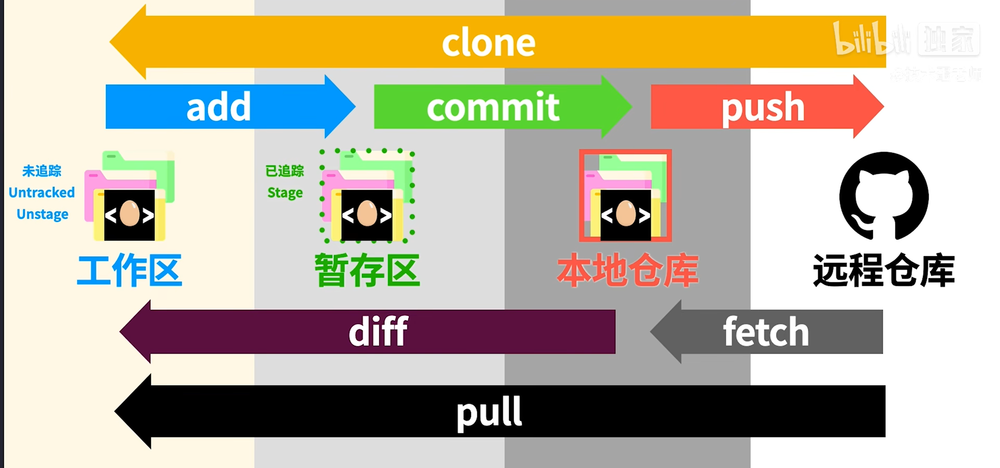
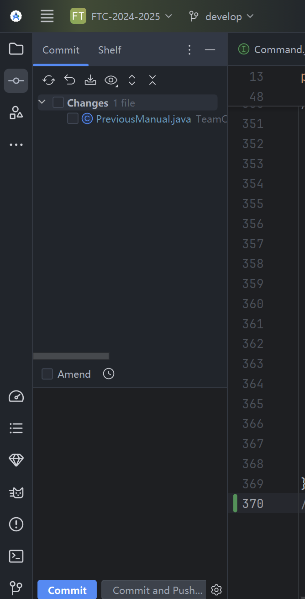
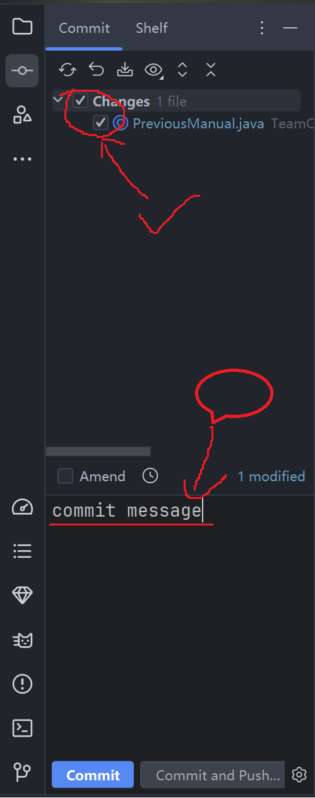
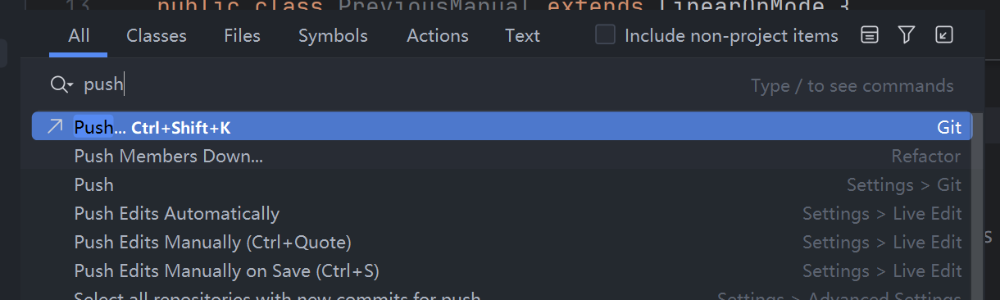
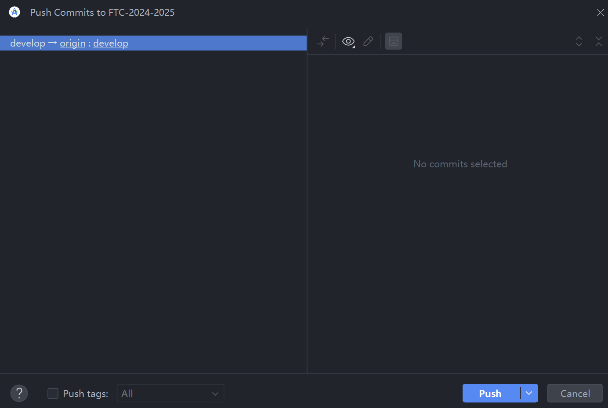
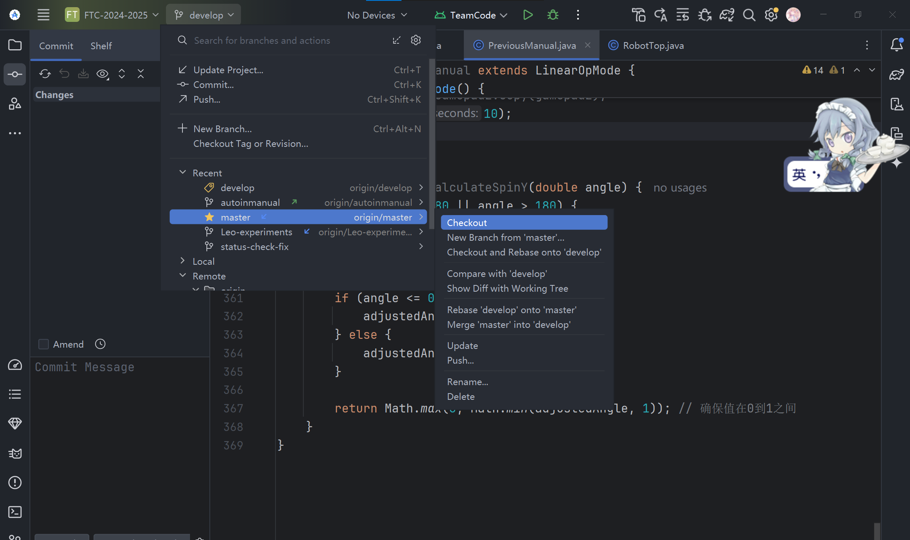
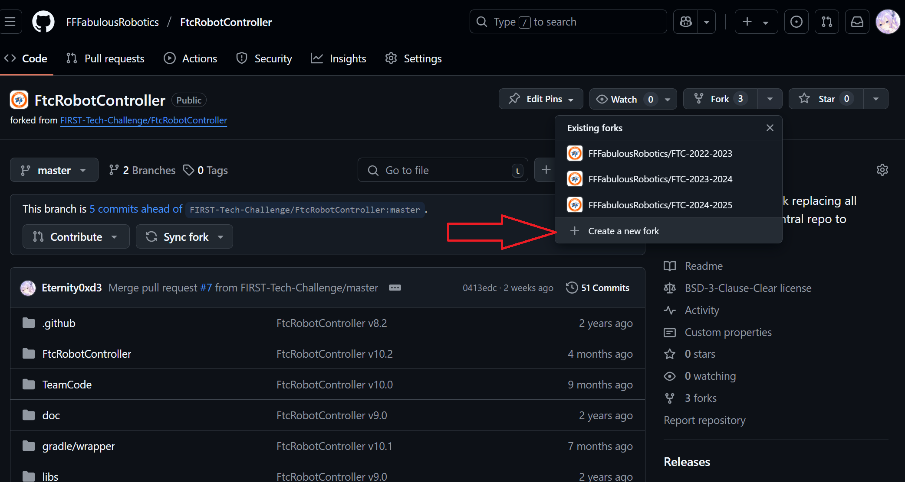
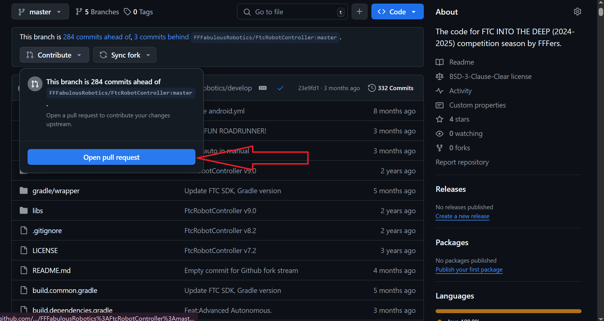
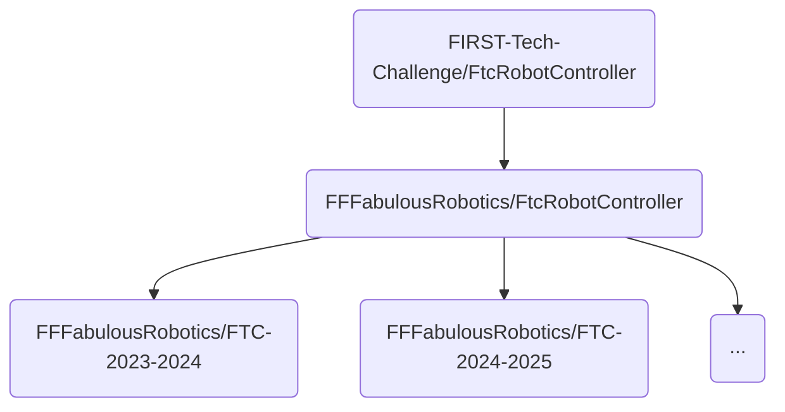
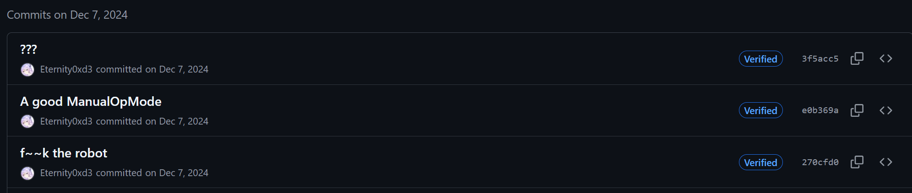

# Git与Github

> 在本章中，我不会向你介绍Git的具体安装步骤（你应该在[Course 0](../Course 0/Real Course 0 (zh-CN).md)中已经安装好了）
>
> 如果你想要跳过枯燥的介绍环节，请跳转到[#4](#4. 在机器人编写中，你需要知道)

## 0.什么是GIt？

Git 是一个用于管理源代码的分布式版本控制系统。版本控制系统会在您修改文件时记录并保存更改，使您可以随时恢复以前的工作版本。使用 Git，您可以轻松访问源代码的修改历史记录。您可以看到版本如何更改以及更改的人。因为整个 Git 历史都存储在共享存储库中，所以 Git 可以防止旧版本的无意覆盖。

简而言之，像 Git 这样的版本控制系统可以很容易地

- **跟踪代码历史记录**
- **以团队形式协作编写代码**
- **查看谁做了哪些更改**


## 1. 基本概念

我们先来理解下 Git 工作区、暂存区和版本库概念：

- **工作区：**工作区是你在本地计算机上的项目目录，你在这里进行文件的创建、修改和删除操作。工作区包含了当前项目的所有文件和子目录。
- **暂存区：**暂存区是一个临时存储区域，它包含了即将被提交到版本库中的文件快照，在提交之前，你可以选择性地将工作区中的修改添加到暂存区。
- **版本库：**版本库包含项目的所有版本历史记录。每次提交都会在版本库中创建一个新的快照，这些快照是不可变的，确保了项目的完整历史记录。

下面这个图展示了工作区、版本库中的暂存区和版本库之间的关系：


文件可以在这些区域(状态)中来回切换。

多人协作中，Git常常与Github一起使用，上面这张图的版本库指**本地版本库**，在使用Github时，还有**本地版本库**和**远程版本库**之分，请在阅读后面内容时注意他们的区别。

## 2. 基本操作

一般而言，大多数的Git操作都是在命令行中完成的。当然，也可以选择图形化软件来直观地使用。

对于初学者而言，使用图形化的Git管理插件是一个不错的选择。幸运地，在大多数IDE（包括Android studio，VSCode）中都有这种图形化插件。

### 2.0 基础操作流程

 

### 2.1 Add  &  Commit

通过**add和commit**，可以把当前的**工作区**的代码提交到**本地版本库**并记录

#### Android Studio

当你对**本地的已追踪文件**做出修改时，左侧栏中会显示对应的更改**"Changes"**

你可以勾选更改的文件，并把它提交到版本库，并附上提交信息**"Commit message"**（概述这次提交，比如改了什么）





点击最下方的commit，就可以提交到**本地版本库**了。

值得注意的是，在Android Studio中，省去了add(暂存)的操作。无需add即可直接commit

#### Command Line

在命令行中就显得比较繁琐了，首先需要在命令行打开工作区文件夹（即带有.git文件夹的主目录）

你可以打开到那个文件夹后右键，选择使用终端打开

如果没有，在上方地址栏输入cmd

然后需要手动把修改的文件手动add到暂存区，然后再commit

```shell
git add <filename>  # 添加指定文件到暂存区
git add .           # 添加所有更改到暂存区
```

```shell
git commit -m "commit message"  # 提交暂存区的更改到本地仓库
```

如果想要取消一个已经add的文件，则要输入：

```shell
git reset <filename>
```

### 2.2 Push

通过**push**，可以把**本地版本库**的数据同步到**远程版本库**（如Github）

#### Android Studio

在提交之前直接选择**“commit and push"**可以一次性完成commit和push。如果你已经commit了当时还没有push，你可以**双击右shift**,在弹出的界面中输入**push**





点击Push即可（我这里没有commit内容，所以是空的，如果你有本地commit，右侧应该会有对应内容）

在提交到远程之前，会强制进行一次代码合并（merge），把本地代码和远程代码合并成同一份。

通常来说，程序可以智能地完成，但是有的时候，会出现冲突，需要人工解决冲突（resolve conflict)。

后面再讲。

#### Command Line

在commit之后，输入：

```shell
git push
```

同样地，也可能会需要解决冲突。

### 2.3 Resolve conflict

一般情况下，对于简单的冲突，Git可以智能地解决：

+ 对不同文件的修改，同一文件之内没有冲突
+ 对同一个文件修改了，但是没有对同一方法的逻辑修改

如果Git无法智能地合并代码，通常因为修改了同一份代码的同一个方法，或是变量，需要人工解决冲突

#### Android Studio

界面大概长成这样：


你可以选择使用谁的代码（yours还是theirs）

如果情况再复杂一点，可能会长这样


左边和右边的颜色部分是有冲突的部分，可以点击左箭头和右箭头来选择把哪些文件的部分语句作为结果（中间）

结束后选择apply即可解决冲突

#### Command Line

在命令行中，用git status命令查询是否有冲突
 ```shell
   $ git status
   > # On branch branch-b
   > # You have unmerged paths.
   > #   (fix conflicts and run "git commit")
   > #
   > # Unmerged paths:
   > #   (use "git add <file>..." to mark resolution)
   > #
   > # both modified:      styleguide.md
   > #
   > no changes added to commit (use "git add" and/or "git commit -a")
 ```

此时，你的冲突的文件会长成这样：

```
If you have questions, please
<<<<<<< HEAD
open an issue
=======
ask your question in IRC.
>>>>>>> branch-a
```

在 **<<<< 到 ==== 之间**以及 **==== 到 >>>> 之间**是一对冲突，手动选择要哪部分并把多余部分删除，然后再次提交commit

~~（我觉得是个人看到这玩意都得心脏骤停）~~

### 2.4 Pull

与Push相反，**Pull**用来把**远程版本库**的代码同步到自己的**本地版本库**

#### Android Studio

双击右shift，输入**pull**或者**update**，直接点即可。

当然，如果你的还没提交的代码和远程大相径庭，可能也需要解决冲突

#### Command Line

用pull命令来同步本地，pull后面什么也不加默认master/origin，pull后面可以加分支名

```shell
git pull
git pull origin
```

### 2.5 Branch: Checkout, Merge

使用分支意味着你可以从开发主线上分离开来，然后在不影响主线的同时继续工作。

#### Android Studio



点击左上边的分支按钮，点击当中的new branch可以新建分支。选择一个分支选择checkout可以进入该分支

选择一个分支选择merge 'xxx' into 'xxx'可以把选择的分支合并到当前分支（可能需要解决冲突）

#### Command Line

创建新分支并切换到该分支：

```shell
git checkout -b <branchname>
```

切换分支命令:

```shell
git checkout <branchname>
```

将其他分支合并到当前分支：

```shell
git merge <branchname>
```

## 3. Github相关

### 3.1 Fork

Github中的Fork是一个重要的协作功能，它允许用户复制**别人的GitHub仓库**到**自己的GitHub账户**中，从而创建一个独立的**副本**。

在fork的副本仓库中，在不提**Pull Request**的情况下，不会对主仓库的内容造成影响，方便自己在原来的代码上进行修改并进行版本控制。如有必要，也可以提Pull Request合并到主仓库。



就以机器人代码为例，主仓库是来自FTC官方的版本仓库([FIRST-Tech-Challenge/FtcRobotController](https://github.com/FIRST-Tech-Challenge/FtcRobotController))，FTC官方在这个仓库中进行依赖库的更新。

我们的Github组织中的FtcController([FFFabulousRobotics/FtcRobotController](https://github.com/FFFabulousRobotics/FtcRobotController))仓库fork自这个官方版本仓库，我们在这个fork的仓库中，添加一些自己的代码内容（如添加镜像源，其他库等）

正在使用的FTC2024-2025([FFFabulousRobotics/FTC-2024-2025](https://github.com/FFFabulousRobotics/FTC-2024-2025))仓库fork自我们的组织中的FtcController，并加入自己的代码

### 3.2 Pull Request

在Git版本控制系统中，Pull Request（PR）是一种协作开发的重要机制，它**允许开发者将自己的改动提交到项目仓库，并请求项目的维护者审查和合并这些改动**。

他通常和**Issue**，**Fork**一起使用，我们在自己Fork的仓库中修改代码后，可以提出Pull Request把这份代码合并到主仓库中，这一操作需要项目的维护者审查。



## 4. 在机器人编写中，你需要知道


<p style="font-size: 3rem; color: red">十分重要！！一定要看！！</p>


### 4.1  我们使用的机器人仓库的fork流：



[FIRST-Tech-Challenge/FtcRobotController](https://github.com/FIRST-Tech-Challenge/FtcRobotController)： 官方FTC版本仓库

[FFFabulousRobotics/FtcRobotController](https://github.com/FFFabulousRobotics/FtcRobotController)： fork到FFFabulous组织里的自己的代码仓库，用于同步更新依赖库版本，加镜像源和其他库，**里面不应该有TeamCode的任何代码！这只是一个类似模版的仓库**（历年代码都fork自这个仓库）

[FFFabulousRobotics/FTC-2024-2025](https://github.com/FFFabulousRobotics/FTC-2024-2025)： 存放今年代码的仓库

**因此，在这个流程中，你永远不应该反向提出任何pull request！**

### 4.2  关于master分支保护：

> 我实际上一直觉得我们的代码开这个功能没啥必要，但是懒得关（

FTC-2024-2025仓库中，不能直接提交代码到master中

你需要在其他分支完善代码，然后通过pull request合并到master分支

这从一定角度促进人们合理分工，并留下开分支测试新功能的好习惯

如果你们哪天真的烦了就把master保护关了把（

### 4.3  你不能干的事情！

你最好不要干以下事情：

+ 把TeamCode代码反过来提到controller仓库

+ 在commit消息中留下依托答辩（如图）

  

+ sudo rm -rf /

+ 其他的没想到
